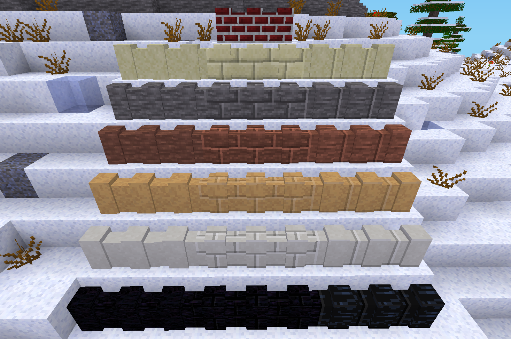

# `mywalls` minetest mod

Adds more wall types for [`walls` mod from `minetest_game`](https://github.com/minetest/minetest_game/tree/master/mods/walls).

Walls mod comes with Minetest Game. It includes **only** 3 types of walls.

This mod extends it to include 19 more types.  
All walls are added into the `walls` mod namespace and use its API.

Included in this mod walls are:
 - wall for `"default:brick"`
 - walls for:
   - `"default:sandstone"`
   - `"default:sandstonebrick"`
   - `"default:sandstone_block"`
 - walls for:
   - `"default:stone"`
   - `"default:stonebrick"`
   - `"default:stone_block"`
 - walls for:
   - `"default:desert_stone"`
   - `"default:desert_stonebrick"`
   - `"default:desert_stone_block"`
 - walls for:
   - `"default:desert_sandstone"`
   - `"default:desert_sandstone_brick"`
   - `"default:desert_sandstone_block"`
 - walls for:
   - `"default:silver_sandstone"`
   - `"default:silver_sandstone_brick"`
   - `"default:silver_sandstone_block"`
 - walls for:
   - `"default:obsidian"`
   - `"default:obsidian_brick"`
   - `"default:obsidian_block"`

Licence - DWYWPL
